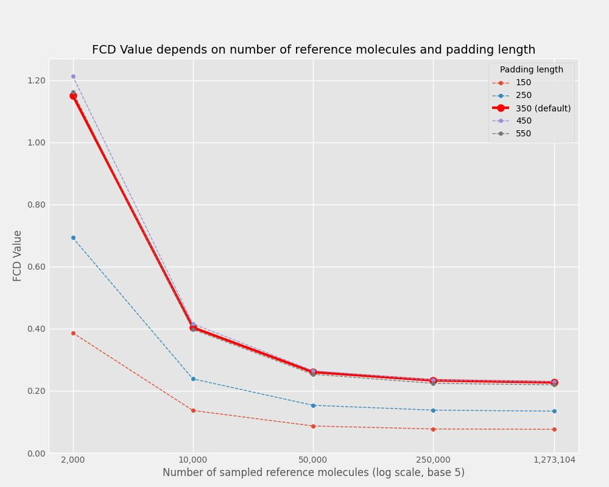

# GuacaMolEval

This small repository evaluates the effects of two factors on the Fréchet ChemNet Distance metric value. The two factors are:

- Sample size of the reference molecules (GuacaMol uses a sample size of 10,000 molecules for both generated and reference molecules).
- Padding length of the molecules (the [`fcd`](https://pypi.org/project/FCD/) package uses a hard-coded padding length of 350).

For this to work we use local forks of the [`fcd`](https://pypi.org/project/FCD/) and [`guacamol`](https://pypi.org/project/guacamol/) packages. The main reasons for this and resulting changes are:

- The `fcd` package used too much memory (> 50GB) in our experiments when calculating the FCD for the whole GuacaMol training / reference set. A minor change reduced the memory footprint. This might be a local issue, but it was necessary for the evaluation. A pull request was opened to discuss this issue.
- The padding length of the molecules is hard-coded in the `fcd` package. We changed this directly in the code for each experiment to allow for a custom padding length.
- The `guacamol` package did not allow for a custom sample size of the reference molecules. We allowed for a parametrization of the sample size. This was necessary to evaluate the effect of the sample size on the FCD metric.
- We updated the dependencies of the `guacamol` package to work with the latest versions of `pytorch` (no `tensorflow`, no `keras`) among others.

We calculated the FCD for a sample set before and after the changes to ensure that the changes did not affect the FCD metric value.

## The main files

| File                                  | Description                                            |
|---------------------------------------|--------------------------------------------------------|
| `data/generated/generated_smiles.csv`   | The generated sample molecules in SMILES format        |
| `data/reference/guacamol_v1_train.csv`  | The reference molecules from GuacaMol in SMILES format |
| `data/fcd.csv`                          | The FCD values of the experiments                      |
| `figures/fcd_values.jpg`                | The FCD values of the experiments as a plot            |
| `src/guacamoleval/eval.py`              | The main evaluation script                             |
| `src/guacamoleval/experiment(s).sh`     | Sample calls of eval.py                                |
| `src/guacamoleval/create_figures.ipynb` | The plotting script                                    |

## Resulting plot

## Discussion
- The FCD value is affected by both the sample size of the reference molecules and the padding length of the molecules.
- Guacamol uses a sample size of 10,000. We see that choosing a higher sample size, or even the whole reference set, can lead to a lower FCD value.
- Reducing the padding length of the molecules can lead to a lower FCD value; but since the value of 350 is hard-coded in the `fcd`package, we could consider changing this value as "cheating" in the evaluation.
- If we ever need to increase the paddding length to allow for longer SMILES strings, we might need to re-evaluate existing FCD metrics. However, the effect of increasing the padding length seems to be minor.

## Known issues

- We only changed the `guacamol` code for the distribution learning benchmark; the other benchmarks might not work without changes.
- The KL Divergence metric is not evaluated in this repository (commented out).

## Meta

- Stephan Holzgruber - stephan.holzgruber@gmail.com
- Distributed under the MIT license. See `LICENSE` for more information.
- [https://github.com/hogru/GuacaMolEval](https://github.com/hogru/guacamoleval)
